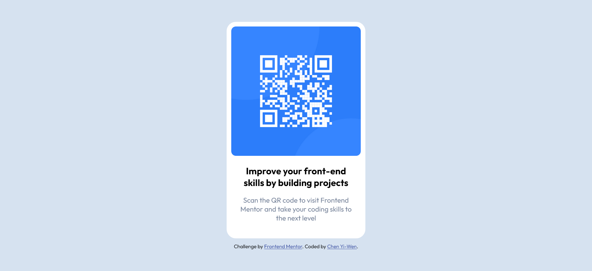

# Frontend Mentor - QR code component solution

This is a solution to the [QR code component challenge on Frontend Mentor](https://www.frontendmentor.io/challenges/qr-code-component-iux_sIO_H). Frontend Mentor challenges help you improve your coding skills by building realistic projects. 

## Table of contents

- [Overview](#overview)
  - [Screenshot](#screenshot)
  - [Links](#links)
- [My process](#my-process)
  - [Built with](#built-with)
  - [What I learned](#what-i-learned)


## Overview

### Screenshot




### Links

- Solution URL: [[Add solution URL here](https://your-solution-url.com)](https://github.com/CHEN-YiWen/QR-code-component)
- Live Site URL: [Add live site URL here](https://your-live-site-url.com)

## My process

### Built with

- Semantic HTML5 markup
- CSS custom properties
- Flexbox

### What I learned

This challenge is relatively easy to complete. I use <code>display: flex</code> to center the card to the middle of the page. As the footer is also in the body, I just need to remember to make the flex-direction into column, or the main and the footer will be displayed horizontally.

```css
body{
    display: flex;
    justify-content: center;
    align-items: center;
    flex-direction: column;
    min-height: 100vh;
    margin: auto;
    background-color: var(--Light-gray);
}
```

## Author
- Frontend Mentor - [@Yiwen Chen](https://www.frontendmentor.io/profile/CHEN-YiWen)
